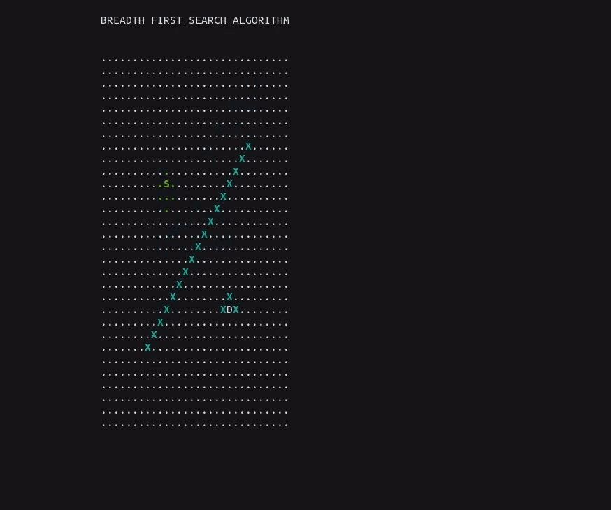
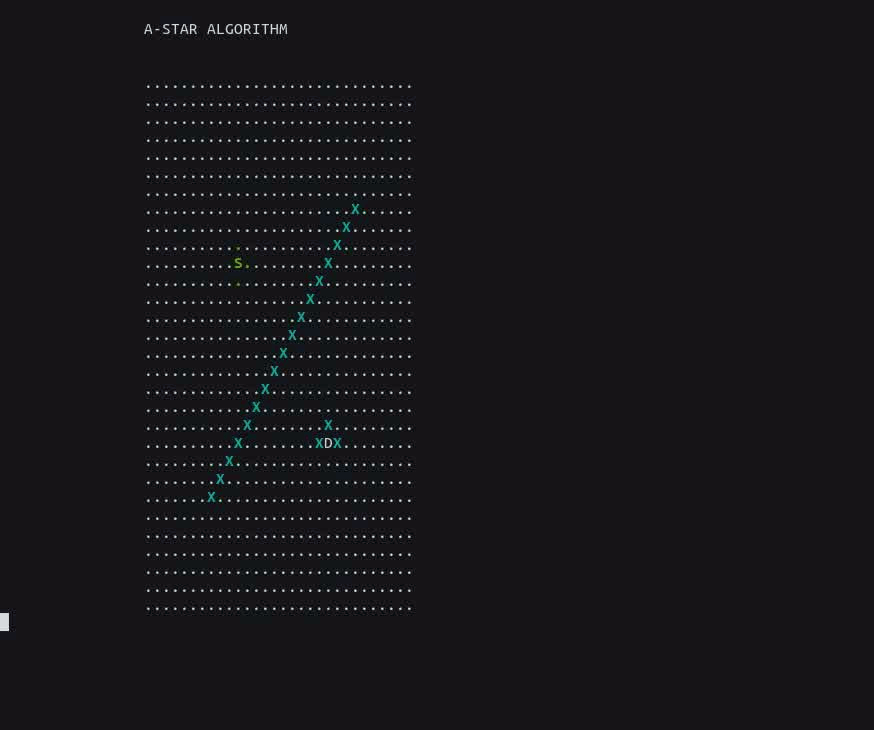

# Path_finding_algorithms_visualizer

This project compares BFS and A* algorithm for path finding.

The starting point is represented by 'S'.\
Destination is represented by 'D'.\
Obstacle is represented by 'X' in cyan color.\
Rest of the cells are represented by '.' which can be part of the path and colored white initially.\
Visited cells will be colored green.\
Coordinates are zero-indexed.

Breadth First Search (BFS) : Searching algorithm where neighbouring cells are explored and added to the queue to get the next cell to start a search. Algorithm stops when the destination is reached.

A* (A-start) : Greedy Searching algorithm where neighbouring cells are explored and added to the priority queue. The cell which is closest to destination is picked for next search.

A* algorithm shines when the presence of obstacles are sparse.\
The number of visited cells for\
BFS = 816\
A* = 216
 
